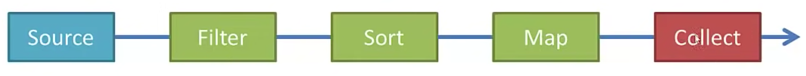

# Java Streams (Filter, Map, Reduce)

## Streams bring functional programming to Java 8+
## Advantages of Streams:-
- Will make you more efficient Java Programmer
- Make have use of `Lambda Expressions`
- ParallelStreams make it very easy to multi-thread operations

## A Stream pipeline consists of a `Source`,   followed by zero or more `intermediate operations`,   and a `terminal operation`.

## Stream Source
Streams can be created from `Collections`, `Lists`, `ints`, `longs`, `doubles`, `arrays` and `lines of file` etc.

## Intermediate Operations
- Such as `filter`, `map` or `sort`
- Returns a stream so that we can chain multiple intermediate operations.
- Order matters do `filter first` then `sort` to improve the performance
- For larger datasets use ParallelStream to enable multiple threads.
- Includes: `anyMatch()`, `distinct()`, `filter()`, `findFirst()`, `flatMap()`, `map()`, `skip()`, `sorted()` etc.

## Terminal Operations
- Returns either void or a non-stream result.
- Only one terminal operation is allowed.
- Such as `forEach`, `collect` or `reduce`
- `forEach` applies the same function to each element.
- `collect` saves the elements into a collection.
- other options `reduce` the strem to s single summary element.
- Includes: `count()`, `max()`, `min()`, `reduce()`, `summaryStatistics()`